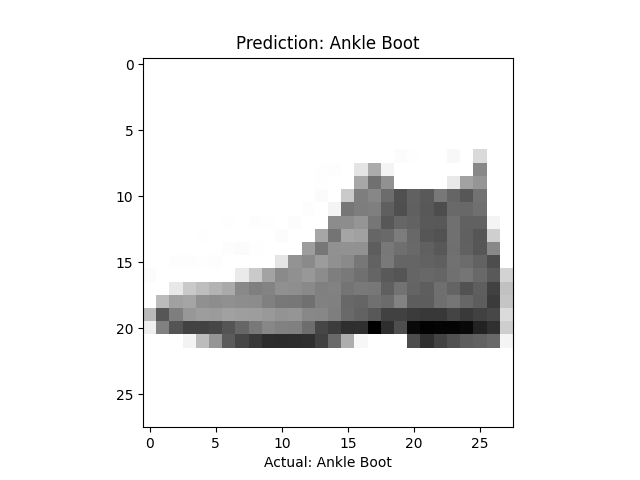
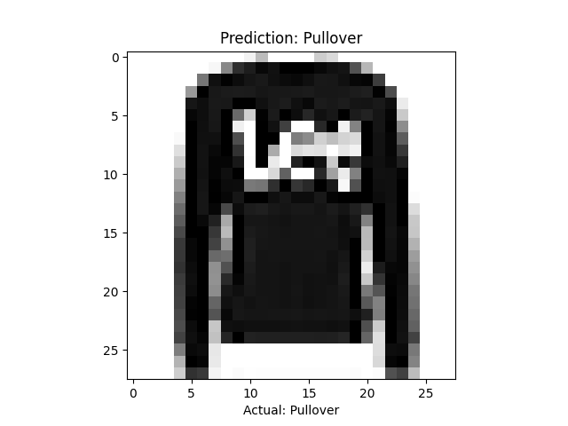
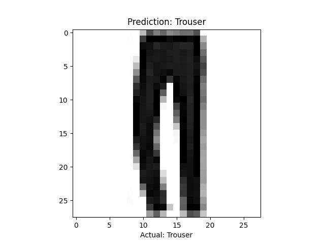
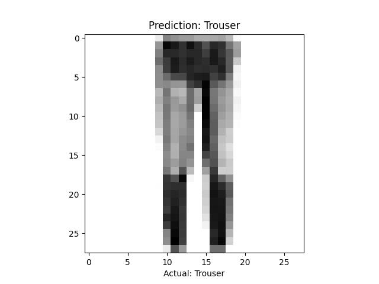
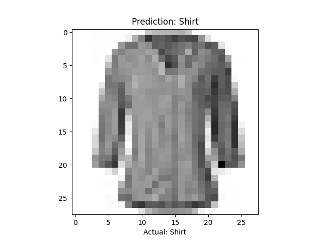

# Fashion MNIST Classification
This code implements a simple convolutional neural network for classifying Fashion MNIST images. The code uses the tensorflow and keras libraries.

# Output
The output of the code will be a plot of the test accuracy as a function of the number of epochs. The plot will also show the predicted labels for 5 test images.

