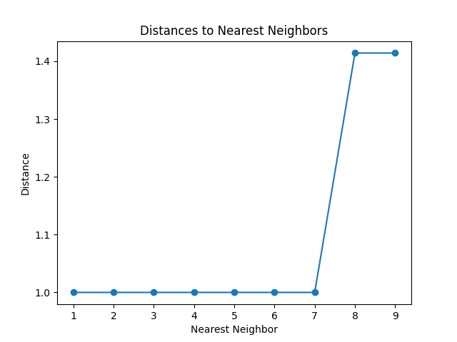

# KNN Car Classifier

This repository contains a Python code that demonstrates the use of K-Nearest Neighbors (KNN) algorithm for car classification based on various features.

## Dataset

The dataset used in the KNN car classifier contains information about various attributes of cars. It includes the following features:

- `buying`: Represents the buying price of the car, categorized as "vhigh" (very high), "high", "med" (medium), or "low".
- `maint`: Indicates the maintenance price of the car, categorized as "vhigh" (very high), "high", "med" (medium), or "low".
- `door`: Represents the number of doors of the car, categorized as "2", "3", "4", or "5more".
- `persons`: Indicates the capacity of persons the car can carry, categorized as "2", "4", or "more".
- `lug_boot`: Represents the size of the car's luggage boot, categorized as "small", "med" (medium), or "big".
- `safety`: Indicates the estimated safety of the car, categorized as "low", "med" (medium), or "high".

Additionally, the dataset contains the target variable:
- `class`: Represents the classification of the car, categorized as "unacc" (unacceptable), "acc" (acceptable), "good", or "vgood" (very good).

The purpose of the KNN car classifier is to predict the class of a car based on these attributes.

## Code Explanation

The provided code demonstrates the use of the K-Nearest Neighbors (KNN) algorithm for car classification based on various features. The code follows these steps:

1. Importing the necessary libraries:
   - `pandas`: Used for data manipulation and analysis.
   - `numpy`: Provides support for numerical operations.
   - `sklearn`: Offers machine learning algorithms and model evaluation tools.
   - `matplotlib`: Utilized for data visualization.

2. Importing and preprocessing the dataset:
   - The car dataset is loaded into a pandas DataFrame using `pd.read_csv("car.data")`.

3. Converting categorical data to numerical:
   - Categorical features in the dataset (`buying`, `maint`, `door`, `persons`, `lug_boot`, `safety`, and `class`) are encoded into numerical values using `preprocessing.LabelEncoder()`.

4. Splitting the dataset into training and testing sets:
   - The features (`X`) and labels (`y`) are created from the encoded data.
   - The dataset is split into training and testing sets using `sklearn.model_selection.train_test_split()`. The testing set size is set to 20% of the data, and the random state is set to 0.

5. Creating and training the KNN classifier:
   - A KNeighborsClassifier is created with `n_neighbors=7`.
   - The classifier is trained using the training data with `model.fit(X_train, y_train)`.

6. Evaluating the model:
   - The accuracy of the model is calculated on the testing set using `model.score(X_test, y_test)`.
   - The accuracy is printed using `print(acc)`.

7. Predicting the labels for the testing set:
   - The model is used to predict the labels for the testing data with `model.predict(X_test)`.
   - The predicted labels are stored in the `predicted` variable.

8. Comparing predicted and actual labels:
   - A list of class names is created as `names` (`["unacc", "acc", "good", "vgood"]`).
   - For each sample in the testing set, the predicted label, corresponding features, actual label, and the neighbors are printed.

9. Extracting and plotting distances to nearest neighbors:
   - The distances and indices of the nearest neighbors for a sample in the testing set are calculated using `model.kneighbors([X_test[x]], 9, True)`.
   - The distances are extracted and stored in the `distances` variable.
   - A line plot is created using `plt.plot(range(1, 10), distances, marker='o')` to visualize the distances to the nearest neighbors.

    

## Conclusion

The KNN car classifier code demonstrates a classification task for cars based on various features. With a KNN model trained on the provided dataset, the classifier achieves an accuracy score of approximately 92.5%.

