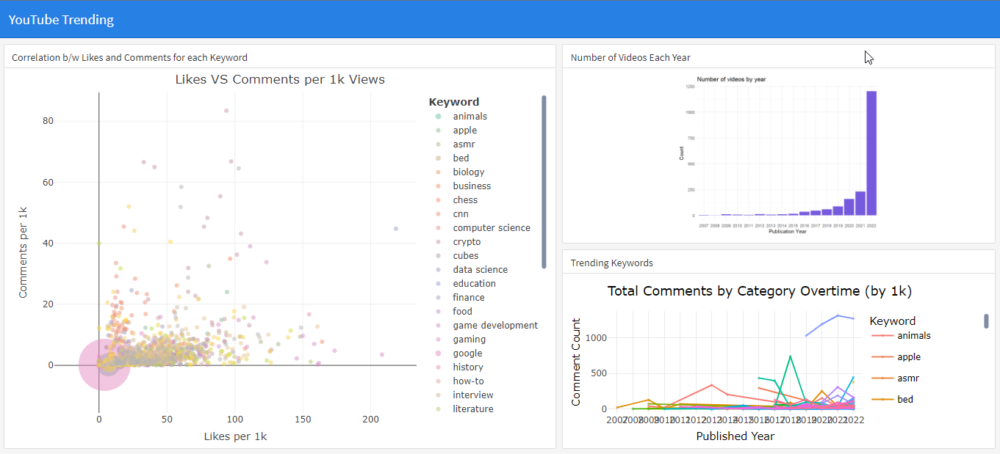

# YouTube Trends Dashboard

YouTubers are faced with the pressure to create content that can potentially become viral and help pave their way to be the Internet’s next sensation. What, then, gets more views nowadays? Are certain categories more popular than others in general? This dashboard with interactive plots helps observe trends in YouTube videos over the past decade.

The project consists of the following components:

1. **Data Preprocessing:** Prepare the YouTube data for analysis by cleaning and transforming it.

2. **Feature Engineering:** Extract relevant features from the data to support meaningful visualization.

3. **Data Visualization:** Utilize ggplot and plotly libraries to create various types of static and interactive plots.

4. **Dashboard Creation:** Develop a static dashboard using flexdashboard to present the visualized data and insights.

